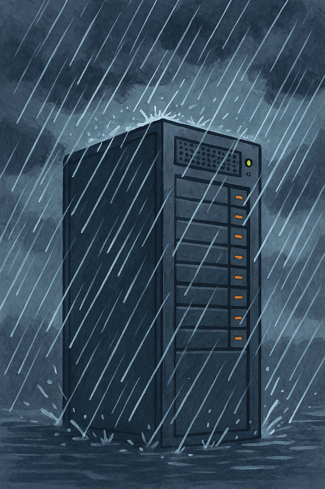

# Raining in the Clouds

A collection of tools that simluate cloud REST API vulnerabilities. The tools provide training for practical skill development based on real-world vulnerabilities in authorization, XSS, and SQL injection. Coverage includes OpenStack, Salesforce, and Google Cloud.

---

#### Prior Work

Based on instructor lead workshop materials in https://github.com/rbeede/pen-testing-cloud-apis

This material includes a self-guided walkthrough of how to setup the tools and complete some of the basic lab exercises. Additional exercises are left for practice by the reader.

## Prerequisites

1. Working knowledge of OWASP Top 10 fundamentals
1. Basic skill with Linux CLI
1. Skill with HTTP MitM tools such as Burp Suite
1. For Salesforce exercises a [Salesforce Developer Edition account](https://developer.salesforce.com/developer-legacy/signup)

## Where to start

### Software Requirements

1. A Linux platform
   - A VM desktop guest is fine for this
     - This guide will use WSL2 (Hyper-V), but other hypervisors that can run a Linux VM can also be used
   - Ubuntu 24.04 (both x86_64 and ARM) have been tested to work
1. An HTTP MitM proxy
   - No specific software requirement, but this guide uses Burp Suite
1. Obtain copies of the following Git repos
   1. https://github.com/rbeede/pen-testing-cloud-apis
   1. https://github.com/Coalfire-Research/cazt
   1. https://github.com/rbeede/paas-cloud-goat
1. Install required dependency software
   1. [gCloud GLI](https://cloud.google.com/sdk/docs/install)
      - Warning: This can take a long time to install via the Debian/Ubuntu method
      - You may find the Linux tar.gz much faster, but make sure to add it to your $PATH
   1. Python 3.12.3 (should come with Ubuntu 24.04)
      - Later versions are okay, but may require some manual workarounds
   1. [Salesforce CLI](https://developer.salesforce.com/tools/salesforcecli)
   1. OpenStack Swift server & client (install instructions given later)

### Education Material

Recommend opening in a new tab so you can return to this guide.

- Why Pentest Cloud APIs
  - [Juniper Support Portal Exposed Customer Device Info; 2024]()
  - [Salesforce Community Cloud data leaks shine light on misconfigurations; 2023](https://www.scworld.com/news/salesforce-community-cloud-data-leaks-misconfigurations)
  - [Salesforce Security Alert: API Error Exposed Marketing Data; 2018](https://www.bankinfosecurity.com/salesforce-security-alert-api-error-exposed-marketing-data-a-11278)
  - [A critical vulnerability was found in Google Security Operations SOAR; GCP-2025-049; 2025](https://cloud.google.com/support/bulletins#gcp-2025-049)
  - [A path traversal vulnerability in the NPM package installation process of Google Cloud Dataform; CVE-2025-9118; GCP-2025-045; 2025](https://cloud.google.com/support/bulletins#gcp-2025-045)
  - [OSSA-2019-006: Credentials API allows listing and retrieving of all users credentials; 2019](https://security.openstack.org/ossa/OSSA-2019-006.html)

- [High Level Ideas](https://github.com/rbeede/pen-testing-cloud-apis/blob/main/documentation/study_material/README.md)
  - [Authorization Vulnerabilities](https://github.com/rbeede/pen-testing-cloud-apis/blob/main/documentation/study_material/auth-vulns.md)
  - [Cross-site Scriptiong (XSS)](https://github.com/rbeede/pen-testing-cloud-apis/blob/main/documentation/study_material/xss.md)
  - [Injection](https://github.com/rbeede/pen-testing-cloud-apis/blob/main/documentation/study_material/injection.md)

---

## Next Step

[Software Configuration](documentation/configuration.md)
